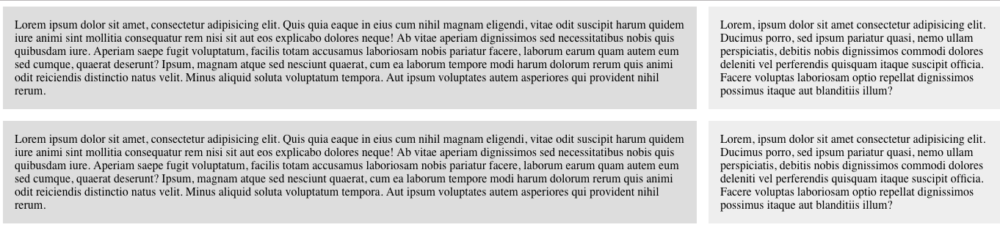
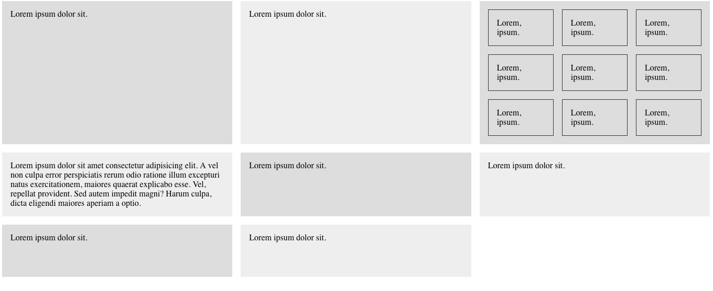
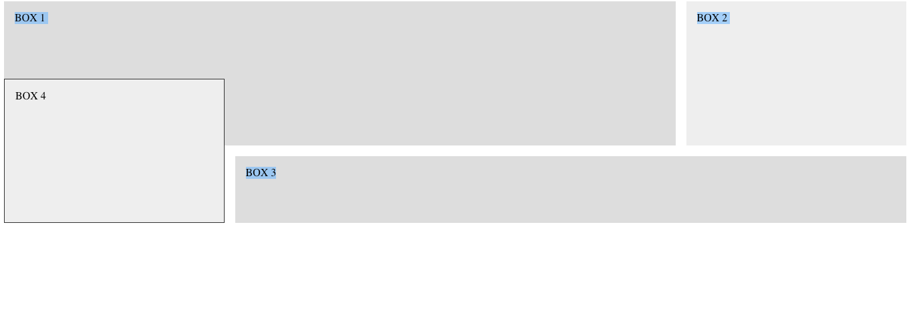

# CSS Grid
An intro to using CSS Grid with several examples.

## index.html
A simple example of column layout and spacing.

## index2.html
Another example of layout and spacing with a grid inside of a grid.

## index3.html
An example of layout and overlap.
